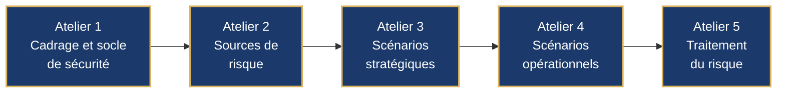
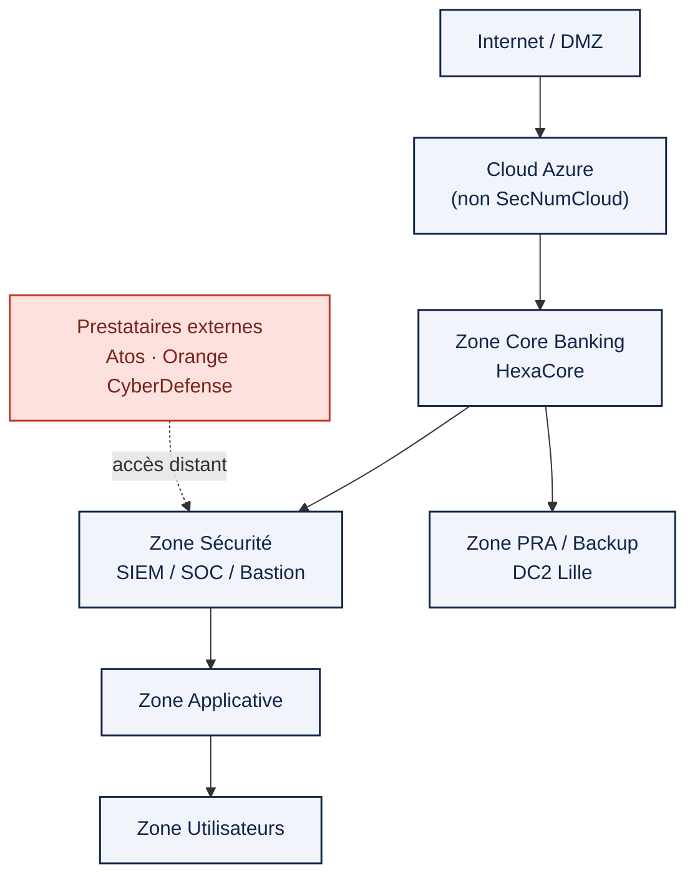
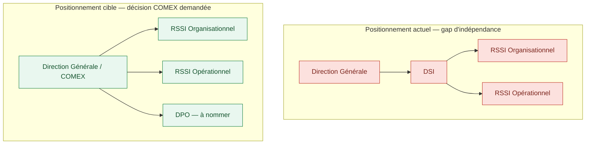

 

*Étude de cas — Mission de gouvernance SSI conduite pour Hexagone Bank (établissement bancaire fictif, construit avec un souci de réalisme opérationnel total : référentiels réels, méthodologie ANSSI, chiffrage économique réaliste). Mission menée en binôme dans le cadre d'un cursus spécialisé en cybersécurité, 2025-2026. Ce document restitue le rôle de **RSSI Organisationnel**, tenu par Loïc Wilfried Yamga.*

 

## Sommaire

- [Résumé exécutif](#résumé-exécutif)
- [Contexte métier — Hexagone Bank](#contexte-métier--hexagone-bank)
- [La mission](#la-mission)
- [Objectifs stratégiques](#objectifs-stratégiques)
- [Méthodologie](#méthodologie)
- [Livrables clés](#livrables-clés)
- [Analyse de risques EBIOS Risk Manager — le cœur de la mission](#analyse-de-risques-ebios-risk-manager--le-cœur-de-la-mission)
- [Trajectoire cybersécurité — PACS 2025-2027](#trajectoire-cybersécurité--pacs-2025-2027)
- [Référentiels mobilisés](#référentiels-mobilisés)
- [Compétences mobilisées](#compétences-mobilisées)
- [Résultats et valeur créée](#résultats-et-valeur-créée)
- [Galerie visuelle](#galerie-visuelle)
- [Ce que cette mission m'a appris sur le métier de RSSI](#ce-que-cette-mission-ma-appris-sur-le-métier-de-rssi)
- [Conclusion](#conclusion)

---

## Résumé exécutif

Hexagone Bank est un établissement bancaire de 8 500 collaborateurs, 185 agences et 4,2 milliards d'euros de chiffre d'affaires annuel, entré en 2025 dans le champ d'application de **DORA** (Digital Operational Resilience Act), le règlement européen qui fait désormais office de *lex specialis* pour la résilience numérique du secteur financier.

À la demande de la Direction Générale, j'ai conduit — aux côtés de mon binôme opérationnel — la mission de structuration complète de la gouvernance cybersécurité de l'établissement : de l'inventaire des actifs jusqu'à la feuille de route budgétée, en passant par un audit de maturité, une analyse de risques EBIOS Risk Manager, la refonte de la gouvernance des prestataires critiques et la conception du plan de continuité d'activité.

Le résultat : un état des lieux sans concession (maturité **faible à moyenne** sur 6 des 8 domaines audités), une cartographie précise de **9 scénarios de risque** dont **4 restent non acceptables** après traitement — nécessitant un arbitrage formel du COMEX — et une trajectoire de transformation chiffrée à **23,9 M€ sur trois ans**, structurée en **20 projets** répartis en 3 vagues de priorité.

La mission s'est conclue par une restitution exécutive de 18 slides devant un COMEX, avec **cinq décisions concrètes** demandées à la Direction Générale — dont le rattachement direct du RSSI à la Direction Générale, condition de son indépendance.

---

## Contexte métier — Hexagone Bank

| | |
|---|---|
| **Raison sociale** | Hexagone Bank — Société Anonyme, établissement de crédit |
| **Siège** | Paris La Défense · fondée en 2008 |
| **Effectif** | 8 500 collaborateurs |
| **Chiffre d'affaires** | 4,2 Md€ / an |
| **Implantations** | 185 agences (France) + filiales Allemagne, Italie, Espagne |
| **Infrastructure** | DC1 (Île-de-France, production) + DC2 (Lille, secours) + Cloud Microsoft Azure hybride |
| **Activités** | Banque de détail, banque digitale, assurance, services financiers aux entreprises |
| **Budget IT** | 294 à 336 M€/an (7-8 % du CA) |
| **Enveloppe cyber** | 20-25 M€ sur 2025-2027 |
| **Régulateur** | ACPR |
| **Déclencheur réglementaire** | Entrée en vigueur de DORA (UE 2022/2554) le 17 janvier 2025 |

Hexagone Bank s'appuie sur un système bancaire central (**HexaCore**), une plateforme de paiements SEPA/SWIFT, un portail web et une application mobile, des API Open Banking (DSP2), et délègue trois fonctions critiques à des tiers : le SOC (**Orange CyberDefense**, supervision N2/N3), la tierce maintenance applicative (**Atos/Eviden**) et l'hébergement cloud (**Microsoft Azure**, non qualifié SecNumCloud).

**Le constat de départ, posé dès la fiche d'identité de l'établissement, est sans détour** : absence de PSSI validée et diffusée, politique de mots de passe obsolète, PCA/PRA existants mais jamais testés, absence de CMDB centralisée, aucune politique cloud/API formalisée — et un RSSI rattaché à la DSI plutôt qu'à la Direction Générale, une faiblesse structurelle de gouvernance identifiée dès l'organigramme.

---

## La mission

Une banque de cette taille ne peut plus, depuis janvier 2025, se contenter d'une sécurité informatique empirique : DORA impose une gouvernance formalisée de la résilience opérationnelle numérique, un cadre de gestion des risques liés aux TIC, une supervision documentée des prestataires critiques et des tests de résilience réguliers — sous peine de sanctions et d'exposition réputationnelle et systémique.

Hexagone Bank n'avait ni cartographie fiable de ses actifs, ni analyse de risques formalisée, ni feuille de route cyber priorisée. La mission consistait à combler ce vide en produisant, en conditions réelles de conseil, l'ensemble du dossier de gouvernance SSI qu'un cabinet de conseil en cybersécurité livrerait à un COMEX bancaire : un diagnostic rigoureux, une analyse de risques méthodologiquement irréprochable, et surtout une trajectoire actionnable et budgétée — pas un rapport de plus dans un tiroir.

---

## Objectifs stratégiques

1. **Cartographier** l'exposition réelle d'Hexagone Bank — actifs, flux, dépendances — pour identifier les points de défaillance en cascade.
2. **Évaluer** objectivement la maturité cybersécurité de l'établissement au regard des référentiels ISO 27001, EBIOS RM et NIST CSF.
3. **Modéliser** les scénarios de risque réellement plausibles pour une banque de ce profil, avec la méthode nationale de référence (EBIOS Risk Manager).
4. **Sécuriser la chaîne de sous-traitance**, un vecteur de compromission identifié comme structurellement critique (Atos TMA, Orange CyberDefense, Azure).
5. **Garantir la continuité des activités essentielles** — paiements, comptes clients, supervision sécurité — avec des objectifs de reprise chiffrés.
6. **Prioriser objectivement l'investissement cyber** dans un cadre budgétaire contraint, avec une méthode de scoring défendable devant un COMEX.
7. **Porter la décision au bon niveau** : transformer un audit technique en un arbitrage exécutif documenté.

---

## Méthodologie

La mission suit une chaîne méthodologique continue, où chaque étape nourrit la suivante — de la connaissance du terrain jusqu'à la décision budgétaire.

Chaque flèche est une traçabilité réelle et vérifiable dans le dossier : chacun des **20 actifs** de l'inventaire est relié à un ou plusieurs **scénarios de risque EBIOS RM**, eux-mêmes reliés à un ou plusieurs **projets du PACS**. Aucune action de la feuille de route ne relève de l'intuition — chacune répond à un risque tracé et priorisé selon une grille de score.

---

## Livrables clés

> Neuf livrables structurent le dossier ITSM remis. Ils ne sont pas présentés ici in extenso — chacun est résumé pour sa valeur de décision, pas pour son volume.

| # | Livrable | Ce qu'il apporte |
|---|---|---|
| 01 | **Fiche d'identité & organigramme** | Modélisation du modèle d'affaires bancaire et du gouvernement d'entreprise ; mise en évidence du rattachement du RSSI à la DSI plutôt qu'à la DG — premier gap de gouvernance identifié |
| 02 – 03 | **Inventaire des actifs & cartographie du SI** | 20 actifs critiques classés (échelle DIC 1-4), répartis en 7 zones de sécurité, avec identification de **4 actifs pivots** (Active Directory, IAM, Core Banking, Cloud Azure) dont la compromission entraîne un effet de cascade sur le reste du SI |
| 04 | **Audit interne de sécurité** | Évaluation de maturité sur 8 domaines selon une échelle N1 (Initial) → N5 (Optimisé) inspirée d'ISO 27001, EBIOS RM et NIST CSF — verdict global : **maturité faible à moyenne**, avec analyse de causes racines |
| 05 | **Analyse de risques EBIOS Risk Manager** | Les 5 ateliers ANSSI menés intégralement — 4 valeurs métier, 8 sources de risque, 14 parties prenantes évaluées, **9 scénarios de risque consolidés**, dont 4 résiduels non acceptables |
| 06 | **Gouvernance des prestataires (SLA + PAS)** | Cadre ISO 27036 appliqué au SOC externalisé (Orange CyberDefense) : SLA chiffrés (GTI/GTR), plan d'audit prestataire sur 6 domaines, grille de scoring et clauses de remédiation |
| 07 | **Plan de continuité et de reprise d'activité** | BIA sur 8 processus critiques, RTO/RPO chiffrés (de 30 minutes à 72 heures selon criticité), organisation de crise en 4 phases, budget dédié de 1,9 M€ |
| 08 | **Plan d'action priorisé — PACS** | 20 projets scorés objectivement (impact, faisabilité, coût), organisés en 3 vagues sur 3 ans, pour un budget total de 23,9 M€ |
| — | **Présentation exécutive COMEX** | Restitution de 18 slides face à un comité de direction, avec 5 décisions formelles demandées |

<strong>Voir le détail de la méthode de classification des actifs</strong>

 

Chaque actif est noté sur une échelle **Confidentialité / Intégrité / Disponibilité de 1 à 4**, agrégée en une criticité globale (Critique / Élevée / Moyenne). Sur les 20 actifs recensés : **9 sont classés Critiques**, **8 Élevés**, **3 Moyens**. Cette classification alimente directement le calcul d'impact des scénarios EBIOS RM et la priorisation des projets du PACS — chaque actif porte une référence croisée vers les risques et les projets qui le concernent.

---

## Analyse de risques EBIOS Risk Manager — le cœur de la mission

L'analyse de risques suit intégralement la méthode nationale de l'ANSSI, dans sa structure en cinq ateliers :

**Atelier 1** identifie 4 valeurs métier critiques (services bancaires essentiels, sécurisation des paiements, protection des données sensibles, gouvernance/résilience du SI) et 16 événements redoutés, notés sur une échelle de gravité G1 (mineur) à G4 (critique, survie de l'établissement menacée).

**Atelier 2** évalue 8 sources de risque : le **cybercriminel organisé** ressort comme la source la plus pertinente (motivation forte, ressources importantes), devant le **tiers/prestataire compromis** — une source directement liée à la dépendance d'Hexagone Bank envers Atos et Orange CyberDefense.

**Atelier 3** cartographie 14 parties prenantes de l'écosystème selon une métrique ANSSI (dépendance × pénétration / maturité × confiance). Les **administrateurs systèmes** ressortent comme le vecteur d'attaque le plus critique de tout l'écosystème — accès complet à l'infrastructure, maturité de contrôle insuffisante.

**Atelier 4** modélise les chaînes d'attaque opérationnelles complètes (hameçonnage → vol d'identifiants → mouvement latéral sur l'Active Directory → déploiement de ransomware par GPO ; ou compromission IAM cloud → élévation de privilèges → fraude sur les systèmes financiers). **6 des 9 scénarios sont jugés « très vraisemblables »**.

**Atelier 5** consolide **9 scénarios de risque (R1 à R9)** et arbitre leur traitement :

Trois scénarios illustrent bien la nature des enjeux traités :

- **R3 — Fraude sur virements SWIFT via une mauvaise configuration IAM cloud.** Des rôles cloud trop permissifs et des comptes techniques partagés permettent une élévation de privilèges sur Azure, puis un mouvement latéral jusqu'aux systèmes de paiement — jusqu'à l'émission de virements internationaux frauduleux. C'est le scénario le plus emblématique du dossier : **il reste classé « non acceptable » même après traitement**, et nécessite un arbitrage formel du COMEX.
- **R7 — Backdoor implantée via une mise à jour logicielle d'un fournisseur.** Un attaquant compromet le système d'information d'un éditeur tiers et altère une mise à jour signée, déployée automatiquement en production, y implantant une porte dérobée dans les applications cœur de métier. C'est le scénario jugé le plus difficile à réduire structurellement — la mission le documente explicitement comme un **risque résiduel accepté et surveillé**, plutôt que comme un échec de traitement.
- **R1 — Ransomware via mouvement latéral sur l'Active Directory.** Le scénario le plus classique, mais le plus révélateur : en l'absence de MFA généralisé et de tiering AD, un hameçonnage simple suffit à atteindre les serveurs financiers.

**Sur les 9 scénarios consolidés, 4 restent classés « Élevé / Non acceptable » après application des mesures du PACS** (IAM cloud, PAM, MFA, EDR/XDR, segmentation Zero Trust, SBOM). Conformément à DORA (art. 5§2) et à ISO 27001 (§6.1.3), leur acceptation relève d'une décision formelle du COMEX — pas d'un choix technique du RSSI. C'est précisément ce point qui a structuré la restitution exécutive de la mission.

---

## Trajectoire cybersécurité — PACS 2025-2027

Vingt scénarios de risque et un audit de maturité ne valent rien sans une trajectoire d'investissement crédible. Le PACS (Plan d'Action Cybersécurité) traduit chaque risque en projet, chaque projet en budget, et chaque budget en décision.

**La méthode de priorisation est volontairement objective et reproductible** :

> **Score = (Impact × 2) + Faisabilité + (5 − Coût)**

Impact et faisabilité sont notés de 1 à 4, le coût est inversé (un projet cher pénalise son score). Les projets scorant ≥ 13 sont engagés sans délai (7 projets), ceux entre 11 et 12 sont structurants (11 projets), les autres sont complémentaires (2 projets).

Le PACS n'est pas qu'un calendrier — c'est un budget structuré et défendable : **294-336 M€ de budget IT annuel**, dont **20 à 25 M€ dédiés au cyber sur trois ans**, pour un plan chiffré à **23,9 M€**, laissant une marge de manœuvre volontaire pour l'imprévu. La priorisation par score a elle-même généré une économie estimée à 1,9 M€ en évitant les projets à faible ratio impact/coût.

---

## Référentiels mobilisés

| Référentiel | Rôle dans la mission |
|---|---|
| **DORA** (UE 2022/2554) | Cadre de résilience opérationnelle numérique du secteur financier, en vigueur depuis le 17/01/2025 — traité comme *lex specialis*, prioritaire sur NIS2 (art. 1§2) |
| **PCI DSS v4.0** | Sécurisation des flux et données de paiement par carte |
| **ISO/IEC 27001:2022** | Structuration du système de management de la sécurité de l'information |
| **ISO/IEC 27005:2022** | Méthodologie d'appréciation et de traitement des risques SSI |
| **ISO/IEC 27036** | Sécurité des relations avec les fournisseurs et prestataires (SOC, TMA, cloud) |
| **ISO 22301:2019** | Système de management de la continuité d'activité — socle du PCA/PRA |
| **EBIOS Risk Manager** (ANSSI) | Méthode nationale d'analyse de risque par scénarios — colonne vertébrale de la mission |
| **RGPD & ACPR** | Conformité protection des données et exigences de contrôle interne bancaire français |

---

## Compétences mobilisées

`Gouvernance SSI` · `Gestion des risques (EBIOS RM)` · `Continuité d'activité (BIA, PCA/PRA)` · `Conformité réglementaire (DORA, RGPD, PCI DSS, ISO 2700x, ISO 22301)` · `Gestion des risques tiers (ISO 27036)` · `Élaboration de stratégie et feuille de route cyber` · `Construction de business case & arbitrage budgétaire` · `Audit et évaluation de maturité` · `Communication exécutive (COMEX / CODIR)`

---

## Résultats et valeur créée

✔ **Gouvernance SSI structurée** — gap d'indépendance du RSSI objectivé et porté en décision COMEX
✔ **Exposition cartographiée** — 20 actifs critiques classés, 4 actifs pivots identifiés comme priorités absolues de protection
✔ **Analyse de risques EBIOS RM complète** — 9 scénarios consolidés, 4 risques résiduels arbitrés au niveau exécutif plutôt que masqués
✔ **Gestion des tiers renforcée** — SLA chiffrés et plan d'audit prestataire opérationnels avec le SOC externalisé
✔ **Continuité d'activité conçue** — RTO le plus exigeant à 30 minutes pour la supervision sécurité, avant même les paiements
✔ **Trajectoire cyber priorisée et budgétée** — 20 projets, 23,9 M€, méthode de scoring défendable devant un COMEX
✔ **Alignement réglementaire total** — DORA, RGPD, PCI DSS, ISO 27001/27005/22301 couverts et tracés
✔ **Vision stratégique consolidée** — restituée en 18 slides et 5 décisions concrètes demandées à la Direction Générale

---

## Galerie visuelle

**Architecture de sécurité simplifiée — 7 zones, actifs pivots**

**Positionnement du RSSI — situation actuelle vs. cible recommandée au COMEX**

---

## Ce que cette mission m'a appris sur le métier de RSSI

La première leçon a été méthodologique : un risque n'existe pour un COMEX que s'il est *traçable* — d'un actif à un scénario, d'un scénario à un projet, d'un projet à un euro. C'est cette exigence de traçabilité, plus que la sophistication technique, qui fait la crédibilité d'une analyse de risques face à une direction générale.

La deuxième a été budgétaire. Construire la formule de scoring du PACS m'a confronté à une réalité que peu de cursus enseignent vraiment : un RSSI ne priorise pas selon la gravité théorique d'un risque, mais selon un arbitrage assumé entre impact, faisabilité et coût. Vouloir tout traiter en même temps, c'est ne rien traiter correctement.

La troisième, la plus structurante, concerne le rapport au risque résiduel. J'ai d'abord été tenté de présenter un plan qui « résolvait tout ». Le scénario R7 — la backdoor implantée via une mise à jour fournisseur — m'a appris le contraire : certains risques ne se réduisent pas, ils se *gouvernent*. Documenter honnêtement qu'un risque reste élevé, en expliquer la raison structurelle, et le remettre entre les mains du COMEX est un acte de gouvernance plus mature que de prétendre l'avoir éliminé.

Enfin, cette mission m'a confirmé qu'un RSSI organisationnel ne défend pas des contrôles techniques — il défend une trajectoire de confiance. La demande de rattachement direct du RSSI à la Direction Générale n'est pas un point d'organigramme secondaire : c'est la condition de crédibilité de tout ce qui précède.

---

## Conclusion

Cette mission a été conduite comme une véritable mission de conseil : un diagnostic sans concession, une méthodologie reconnue (EBIOS Risk Manager, ISO 27001, ISO 22301, ISO 27036), et surtout une traduction constante du risque technique en décision exécutive. Le dossier produit — inventaire, cartographie, audit, analyse de risques, gouvernance des tiers, continuité d'activité et feuille de route budgétée — constitue une base de décision, pas un simple rapport.

C'est cette capacité à faire dialoguer la technique et le COMEX, à assumer un risque résiduel plutôt qu'à le maquiller, et à transformer une analyse de risques en 23,9 M€ de trajectoire priorisée, qui résume le mieux ce que signifie, pour moi, exercer la fonction de RSSI organisationnel.

---

**Loïc Wilfried Yamga** — RSSI Organisationnel
*Mission réalisée en binôme avec Samuel Kissi-Bi (RSSI Opérationnel) — cursus spécialisé en cybersécurité, 2025-2026*

[← Retour au portfolio](../index.md) · [LinkedIn](https://www.linkedin.com/in/loïc-yamga) · [wilfriedyamga@gmail.com](mailto:wilfriedyamga@gmail.com)

