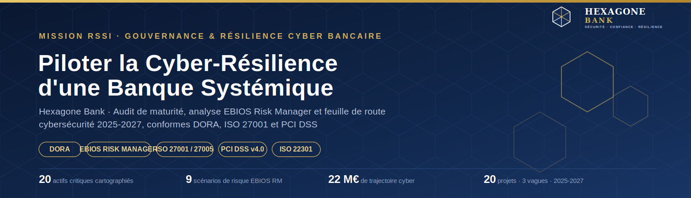
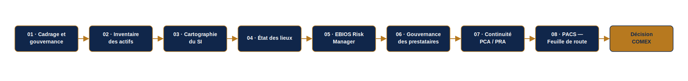
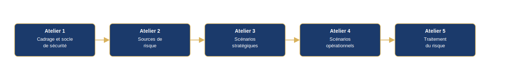
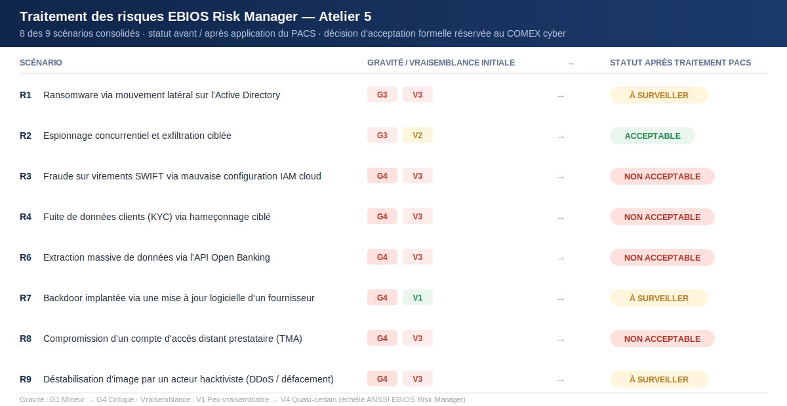
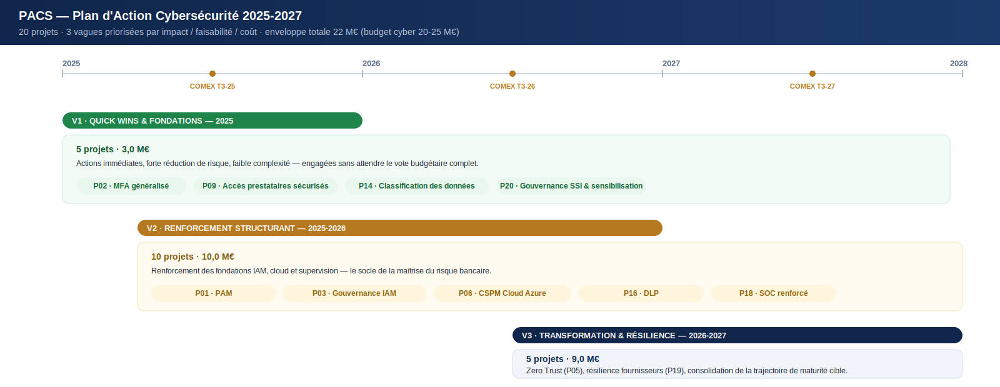
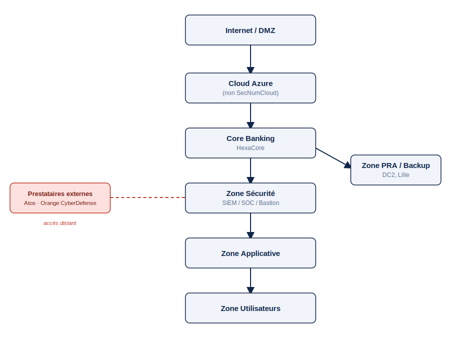
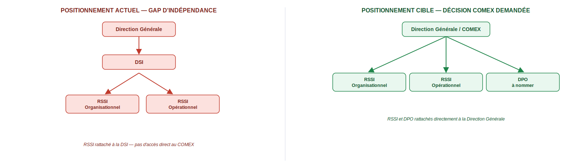

  

  

<em>Étude de cas — Mission de gouvernance SSI conduite pour Hexagone Bank (établissement bancaire fictif, construit avec un souci de réalisme opérationnel total : référentiels réels, méthodologie ANSSI, chiffrage économique réaliste) par Loïc Wilfried Yamga, dans le cadre d'un cursus spécialisé en cybersécurité, 2025-2026.</em>

  

<strong>ONZE RÉFÉRENTIELS MOBILISÉS EN CONDITIONS RÉELLES</strong>

  

 

## Sommaire

- [Résumé exécutif](#résumé-exécutif)
- [Contexte métier — Hexagone Bank](#contexte-métier--hexagone-bank)
- [La mission](#la-mission)
- [Objectifs stratégiques](#objectifs-stratégiques)
- [Méthodologie](#méthodologie)
- [Livrables clés](#livrables-clés)
- [Analyse de risques EBIOS Risk Manager — le cœur de la mission](#analyse-de-risques-ebios-risk-manager--le-cœur-de-la-mission)
- [Gouvernance des prestataires — SLA & PAS](#gouvernance-des-prestataires--sla--plan-dassurance-sécurité)
- [Continuité d'activité — PCA/PRA](#continuité-dactivité--pcapra)
- [Trajectoire cybersécurité — PACS 2025-2027](#trajectoire-cybersécurité--pacs-2025-2027)
- [Gouvernance & pilotage dans la durée](#gouvernance--pilotage-dans-la-durée)
- [Référentiels mobilisés](#référentiels-mobilisés)
- [Compétences mobilisées](#compétences-mobilisées)
- [Résultats et valeur créée](#résultats-et-valeur-créée)
- [Galerie visuelle](#galerie-visuelle)
- [Ce que cette mission m'a appris sur le métier de RSSI](#ce-que-cette-mission-ma-appris-sur-le-métier-de-rssi)
- [Conclusion](#conclusion)

---

> **Note de lecture** — Cette page est une synthèse. Le dossier complet compte 9 livrables et plusieurs centaines de pages (inventaire détaillé des 20 actifs, dossier EBIOS RM intégral avec ses 5 ateliers, PAS et clauses contractuelles, BIA complète, roadmap PACS projet par projet). Ce qui suit met en avant les décisions et les résultats qui comptent pour un lecteur métier — pas l'intégralité du travail, disponible sur demande.

---

## Résumé exécutif

Hexagone Bank est un établissement bancaire de 8 500 collaborateurs, 185 agences et 4,2 milliards d'euros de chiffre d'affaires annuel, entré en 2025 dans le champ d'application de **DORA** (Digital Operational Resilience Act), le règlement européen qui fait désormais office de *lex specialis* pour la résilience numérique du secteur financier.

À la demande de la Direction Générale, j'ai conduit la mission de structuration complète de la gouvernance cybersécurité de l'établissement : de l'inventaire des actifs jusqu'à la feuille de route budgétée, en passant par un audit de maturité, une analyse de risques EBIOS Risk Manager, la refonte de la gouvernance des prestataires critiques et la conception du plan de continuité d'activité.

Le résultat : un état des lieux sans concession (maturité **faible à moyenne** sur 6 des 8 domaines audités), une cartographie précise de **9 scénarios de risque** dont **4 restent non acceptables** après traitement — nécessitant un arbitrage formel du COMEX — et une trajectoire de transformation chiffrée à **22 M€ sur trois ans**, structurée en **20 projets** répartis en 3 vagues de priorité.

La mission s'est conclue par une restitution exécutive de 18 slides devant un COMEX, avec **cinq décisions concrètes** demandées à la Direction Générale — dont le rattachement direct du RSSI à la Direction Générale, condition de son indépendance.

---

## Contexte métier — Hexagone Bank

| | |
|---|---|
| **Raison sociale** | Hexagone Bank — Société Anonyme, établissement de crédit |
| **Siège** | Paris La Défense · fondée en 2008 |
| **Effectif** | 8 500 collaborateurs |
| **Chiffre d'affaires** | 4,2 Md€ / an |
| **Implantations** | 185 agences (France) + filiales Allemagne, Italie, Espagne |
| **Infrastructure** | DC1 (Île-de-France, production) + DC2 (Lille, secours) + Cloud Microsoft Azure hybride |
| **Activités** | Banque de détail, banque digitale, assurance, services financiers aux entreprises |
| **Budget IT** | 294 à 336 M€/an (7-8 % du CA) |
| **Enveloppe cyber** | 20-25 M€ sur 2025-2027 |
| **Régulateur** | ACPR |
| **Déclencheur réglementaire** | Entrée en vigueur de DORA (UE 2022/2554) le 17 janvier 2025 |

Hexagone Bank s'appuie sur un système bancaire central (**HexaCore**), une plateforme de paiements SEPA/SWIFT, un portail web et une application mobile, des API Open Banking (DSP2), et délègue trois fonctions critiques à des tiers : le SOC (**Orange CyberDefense**, supervision N2/N3), la tierce maintenance applicative (**Atos/Eviden**) et l'hébergement cloud (**Microsoft Azure**, non qualifié SecNumCloud).

**Le constat de départ, posé dès la fiche d'identité de l'établissement, est sans détour** : absence de PSSI validée et diffusée, politique de mots de passe obsolète, PCA/PRA existants mais jamais testés, absence de CMDB centralisée, aucune politique cloud/API formalisée — et un RSSI rattaché à la DSI plutôt qu'à la Direction Générale, une faiblesse structurelle de gouvernance identifiée dès l'organigramme.

---

## La mission

Une banque de cette taille ne peut plus, depuis janvier 2025, se contenter d'une sécurité informatique empirique : DORA impose une gouvernance formalisée de la résilience opérationnelle numérique, un cadre de gestion des risques liés aux TIC, une supervision documentée des prestataires critiques et des tests de résilience réguliers — sous peine de sanctions et d'exposition réputationnelle et systémique.

Hexagone Bank n'avait ni cartographie fiable de ses actifs, ni analyse de risques formalisée, ni feuille de route cyber priorisée. La mission consistait à combler ce vide en produisant, en conditions réelles de conseil, l'ensemble du dossier de gouvernance SSI qu'un cabinet de conseil en cybersécurité livrerait à un COMEX bancaire : un diagnostic rigoureux, une analyse de risques méthodologiquement irréprochable, et surtout une trajectoire actionnable et budgétée — pas un rapport de plus dans un tiroir.

---

## Objectifs stratégiques

1. **Cartographier** l'exposition réelle d'Hexagone Bank — actifs, flux, dépendances — pour identifier les points de défaillance en cascade.
2. **Évaluer** objectivement la maturité cybersécurité de l'établissement au regard des référentiels ISO 27001, EBIOS RM et NIST CSF.
3. **Modéliser** les scénarios de risque réellement plausibles pour une banque de ce profil, avec la méthode nationale de référence (EBIOS Risk Manager).
4. **Sécuriser la chaîne de sous-traitance**, un vecteur de compromission identifié comme structurellement critique (Atos TMA, Orange CyberDefense, Azure).
5. **Garantir la continuité des activités essentielles** — paiements, comptes clients, supervision sécurité — avec des objectifs de reprise chiffrés.
6. **Prioriser objectivement l'investissement cyber** dans un cadre budgétaire contraint, avec une méthode de scoring défendable devant un COMEX.
7. **Porter la décision au bon niveau** : transformer un diagnostic technique en un arbitrage exécutif documenté.

---

## Méthodologie

La mission suit une chaîne méthodologique continue, où chaque étape nourrit la suivante — de la connaissance du terrain jusqu'à la décision budgétaire.

Chaque flèche est une traçabilité réelle et vérifiable dans le dossier : chacun des **20 actifs** de l'inventaire est relié à un ou plusieurs **scénarios de risque EBIOS RM**, eux-mêmes reliés à un ou plusieurs **projets du PACS**. Aucune action de la feuille de route ne relève de l'intuition — chacune répond à un risque tracé et priorisé selon une grille de score.

---

## Livrables clés

> Neuf livrables structurent le dossier ITSM remis. Ils ne sont pas présentés ici in extenso — chacun est résumé pour sa valeur de décision, pas pour son volume.

| # | Livrable | Ce qu'il apporte |
|---|---|---|
| 01 | **Fiche d'identité & organigramme** | Modélisation du modèle d'affaires bancaire et du gouvernement d'entreprise ; mise en évidence du rattachement du RSSI à la DSI plutôt qu'à la DG — premier gap de gouvernance identifié |
| 02 – 03 | **Inventaire des actifs & cartographie du SI** | 20 actifs critiques classés (échelle DIC 1-4), répartis en 7 zones de sécurité, avec identification de **4 actifs pivots** (Active Directory, IAM, Core Banking, Cloud Azure) dont la compromission entraîne un effet de cascade sur le reste du SI |
| 04 | **État des lieux de sécurité** | Évaluation de maturité sur 8 domaines selon une échelle N1 (Initial) → N5 (Optimisé) inspirée d'ISO 27001, EBIOS RM et NIST CSF — verdict global : **maturité faible à moyenne**, avec analyse de causes racines |
| 05 | **Analyse de risques EBIOS Risk Manager** | Les 5 ateliers ANSSI menés intégralement — 4 valeurs métier, 8 sources de risque, 14 parties prenantes évaluées, **9 scénarios de risque consolidés**, dont 4 résiduels non acceptables |
| 06 | **Gouvernance des prestataires (SLA + PAS)** | Cadre ISO 27036 appliqué au SOC externalisé (Orange CyberDefense) : SLA chiffrés (GTI/GTR), plan d'audit prestataire sur 6 domaines, grille de scoring et clauses de remédiation |
| 07 | **Plan de continuité et de reprise d'activité** | BIA sur 8 processus critiques, RTO/RPO chiffrés (de 30 minutes à 72 heures selon criticité), organisation de crise en 4 phases, budget dédié de 1,5 M€ |
| 08 | **Plan d'action priorisé — PACS** | 20 projets scorés objectivement (impact, faisabilité, coût), organisés en 3 vagues sur 3 ans, pour un budget total de 22 M€ |
| — | **Présentation exécutive COMEX** | Restitution de 18 slides face à un comité de direction, avec 5 décisions formelles demandées |

<strong>Voir le détail de la méthode de classification des actifs</strong>

 

Chaque actif est noté sur une échelle <strong>Confidentialité / Intégrité / Disponibilité de 1 à 4</strong>, agrégée en une criticité globale (Critique / Élevée / Moyenne). Sur les 20 actifs recensés : <strong>9 sont classés Critiques</strong>, <strong>8 Élevés</strong>, <strong>3 Moyens</strong>. Cette classification alimente directement le calcul d'impact des scénarios EBIOS RM et la priorisation des projets du PACS — chaque actif porte une référence croisée vers les risques et les projets qui le concernent.

<strong>Voir le détail de la méthode de calcul de maturité (état des lieux)</strong>

 

L'évaluation combine une échelle qualitative à <strong>5 niveaux</strong> (inspirée d'ISO 27001, EBIOS RM et NIST CSF), regroupée en 3 paliers pour la lisibilité exécutive :

<table>
<thead><tr><th>Niveau</th><th>Palier</th></tr></thead>
<tbody>
<tr><td>N1 — Initial / N2 — Répétable</td><td>Faible</td></tr>
<tr><td>N3 — Défini</td><td>Moyen</td></tr>
<tr><td>N4 — Maîtrisé / N5 — Optimisé</td><td>Élevé</td></tr>
</tbody>
</table>

Chaque domaine est noté à partir d'entretiens et d'une revue documentaire, puis positionné dans la matrice de maturité globale :

<table>
<thead><tr><th>Domaine</th><th>Verdict</th></tr></thead>
<tbody>
<tr><td>Gouvernance SSI</td><td>Faible</td></tr>
<tr><td>Organisation</td><td>Moyen</td></tr>
<tr><td>Processus métiers</td><td>Faible</td></tr>
<tr><td>Infrastructures et réseaux</td><td>Faible</td></tr>
<tr><td>Applications</td><td>Faible</td></tr>
<tr><td>Données</td><td>Faible</td></tr>
<tr><td>Conformité réglementaire</td><td>Faible à moyen</td></tr>
<tr><td>Sécurité opérationnelle</td><td>Moyen</td></tr>
</tbody>
</table>

Résultat : <strong>6 des 8 domaines classés Faible</strong>, aucun domaine Élevé — un écart structurel, cohérent sur l'ensemble du périmètre, qui justifie l'intégralité de la trajectoire PACS plutôt qu'une simple correction ponctuelle.

---

## Analyse de risques EBIOS Risk Manager — le cœur de la mission

L'analyse de risques suit intégralement la méthode nationale de l'ANSSI, dans sa structure en cinq ateliers :

**Atelier 1** identifie 4 valeurs métier critiques (services bancaires essentiels, sécurisation des paiements, protection des données sensibles, gouvernance/résilience du SI) et 16 événements redoutés, notés sur une échelle de gravité G1 (mineur) à G4 (critique, survie de l'établissement menacée).

**Atelier 2** évalue 8 sources de risque : le **cybercriminel organisé** ressort comme la source la plus pertinente (motivation forte, ressources importantes), devant le **tiers/prestataire compromis** — une source directement liée à la dépendance d'Hexagone Bank envers Atos et Orange CyberDefense.

**Atelier 3** cartographie 14 parties prenantes de l'écosystème selon une métrique ANSSI (dépendance × pénétration / maturité × confiance). Les **administrateurs systèmes** ressortent comme le vecteur d'attaque le plus critique de tout l'écosystème — accès complet à l'infrastructure, maturité de contrôle insuffisante.

**Atelier 4** modélise les chaînes d'attaque opérationnelles complètes (hameçonnage → vol d'identifiants → mouvement latéral sur l'Active Directory → déploiement de ransomware par GPO ; ou compromission IAM cloud → élévation de privilèges → fraude sur les systèmes financiers). **6 des 9 scénarios sont jugés « très vraisemblables »**.

**Atelier 5** consolide **9 scénarios de risque (R1 à R9)** et arbitre leur traitement :

Trois scénarios illustrent bien la nature des enjeux traités :

- **R3 — Fraude sur virements SWIFT via une mauvaise configuration IAM cloud.** Des rôles cloud trop permissifs et des comptes techniques partagés permettent une élévation de privilèges sur Azure, puis un mouvement latéral jusqu'aux systèmes de paiement — jusqu'à l'émission de virements internationaux frauduleux. C'est le scénario le plus emblématique du dossier : **il reste classé « non acceptable » même après traitement**, et nécessite un arbitrage formel du COMEX.
- **R8 — Compromission d'un compte d'accès distant d'un prestataire (TMA).** Un compte utilisé par Atos/Eviden pour la maintenance applicative est détourné, offrant un accès direct à l'infrastructure de production. C'est le scénario qui a justifié le cadre SLA/PAS imposé aux prestataires critiques — et il **reste lui aussi classé « non acceptable »** après traitement : le risque tiers ne se ferme jamais complètement, il se surveille.
- **R7 — Backdoor implantée via une mise à jour logicielle d'un fournisseur.** Un attaquant compromet le système d'information d'un éditeur tiers et altère une mise à jour signée, déployée automatiquement en production, y implantant une porte dérobée dans les applications cœur de métier. Contrairement à R3 et R8, ce scénario est jugé trop systémique pour être totalement neutralisé — la mission le documente explicitement comme un **risque résiduel accepté et surveillé** (classé « Moyen »), plutôt que comme un échec de traitement.

**Sur les 9 scénarios consolidés, 4 restent classés « Élevé / Non acceptable » après application des mesures du PACS** (IAM cloud, PAM, MFA, EDR/XDR, segmentation Zero Trust, SBOM). Conformément à DORA (art. 5§2) et à ISO 27001 (§6.1.3), leur acceptation relève d'une décision formelle du COMEX — pas d'un choix technique du RSSI. C'est précisément ce point qui a structuré la restitution exécutive de la mission.

---

## Gouvernance des prestataires — SLA & Plan d'Assurance Sécurité

L'analyse EBIOS RM a établi un fait structurant : le **tiers/prestataire compromis** est l'une des sources de risque les plus pertinentes pour Hexagone Bank, et l'**administrateur système d'un prestataire** ressort comme le vecteur d'attaque le plus critique de tout l'écosystème (Atelier 3). Hexagone Bank dépend de trois prestataires critiques — **Orange CyberDefense** (SOC externalisé, supervision N2/N3), **Atos/Eviden** (tierce maintenance applicative) et **Microsoft Azure** (hébergement cloud, non qualifié SecNumCloud). Sans cadre contractuel et sans droit d'audit, cette dépendance reste un risque non maîtrisé — c'est ce que ce livrable a fermé.

**Le cadre s'appuie sur ISO/IEC 27036-1 et 27036-3** (sécurité des relations fournisseurs) et sur les articles 28 à 30 de DORA relatifs à la supervision des prestataires TIC critiques. Il répond directement aux scénarios EBIOS **R7** (compromission via la chaîne logicielle), **R8** (compte prestataire compromis) et **R9** (interconnexion cloud exploitée).

**SLA contractualisé avec le SOC externalisé (Orange CyberDefense)** :

| Sévérité | Délai de prise en charge (GTI) | Délai de résolution (GTR) |
|---|---|---|
| G4 — Critique | 1 heure | 4 heures |
| G3 — Grave | 2 heures | 8 heures |
| G2 — Majeure | 3 heures | 24 heures |
| G1 — Mineure | 4 heures | 5 jours ouvrés |

- **Disponibilité contractualisée** : SOC ≥ 99,9 % · portail client ≥ 99,5 % · plateforme de supervision ≥ 99,9 %
- **Notification d'incident au client : 4 heures maximum** — délibérément plus courte que les 72 heures imposées par le RGPD à la banque envers la CNIL, pour lui laisser le temps d'instruire son dossier
- **Pénalités contractuelles** : 5 % de la facturation mensuelle en cas de GTI G4 manqué, 10 % pour un GTR G4 manqué, jusqu'à 15 % en cas de notification tardive d'un incident majeur
- **Hébergement des données limité à l'UE**, tout transfert hors UE soumis à autorisation écrite préalable
- **Droit d'audit annuel**, ou déclenché après tout incident majeur

**Le Plan d'Assurance Sécurité (PAS)** structure l'évaluation de tout prestataire critique sur 6 domaines — gouvernance SSI, IAM/PAM, SOC & détection, gestion des vulnérabilités, protection des données (RGPD), continuité d'activité — sur la base de **17 preuves documentaires obligatoires** (certificat ISO 27001, politique SSI, pentest de moins de 12 mois, PCA/PRA et rapport de test, attestation d'assurance cyber, registre RGPD…). L'absence d'une seule preuve vaut non-conformité documentaire automatique.

| Taux de conformité | Verdict | Délai de remédiation |
|---|---|---|
| 85-100 % | Conforme | — |
| 70-84 % | Conforme avec réserves | Selon criticité de l'écart |
| 50-69 % | Plan d'action correctif obligatoire | 30 j (critique) / 60 j (majeur) / 90 j (mineur) |
| < 50 % | Prestataire rejeté | — |

---

## Continuité d'activité — PCA/PRA

Un risque bien analysé et un prestataire bien audité ne suffisent pas si Hexagone Bank ne sait pas *encaisser* un incident majeur. Le PCA/PRA répond directement aux scénarios EBIOS les plus graves — ransomware généralisé, fraude sur les paiements, compromission massive de données, défaillance d'un prestataire critique — en fixant, activité par activité, le temps que la banque peut tenir avant que l'indisponibilité devienne elle-même une crise.

**Piloté en tant que RSSI Organisationnel**, conformément à l'article 269 de l'arrêté ACPR du 3 novembre 2014 et à l'article 11 de DORA, avec un comité de pilotage réunissant DG, DSI, CTO, DRH, Finance, Assurance et le SOC externalisé.

**Analyse d'impact métier (BIA) — 8 activités critiques classées par ordre de priorité de reprise :**

| Activité | RTO (reprise) | RPO (perte de données max.) |
|---|---|---|
| Supervision sécurité & gestion d'incident | **30 min** | 5 min |
| Paiements & virements | 1 h | 5 min |
| Banque en ligne | 2 h | 15 min |
| Comptes clients | 4 h | 15 min |
| Conformité réglementaire & financière | 8 h | 30 min |
| Crédit & financement | 24 h | 1 h |
| Assurance | 24 h | 1 h |
| Ressources humaines | 72 h | 24 h |

> La supervision sécurité est reprise *avant* les paiements — reprendre l'activité sans avoir repris le contrôle de l'environnement serait rouvrir la porte à l'attaquant.

**5 scénarios de continuité, tracés directement aux risques EBIOS RM** : PCA1 ransomware généralisé sur le SI (Très élevé), PCA2 fraude sur les paiements via compromission IAM (Très élevé), PCA3 compromission massive de données clients (Critique), PCA4 compromission de la chaîne d'approvisionnement logicielle (Très élevé), PCA5 défaillance d'un prestataire critique — SOC, cloud ou TMA (Élevé).

**Organisation de crise en 4 phases** : détection & qualification → fonctionnement en mode dégradé → bascule sur site de secours (DC2, Lille) → retour à la normale. Cellule de crise dirigée par la Direction Générale, avec un rôle de coordination PCA assuré au titre de RSSI Organisationnel.

**Dispositif de test — la continuité n'est crédible que si elle est exercée** : un exercice de gestion de crise par an, un test PRA complet par an, des tests trimestriels de sauvegarde/restauration, et un RETEX systématique après chaque activation ou incident majeur.

**Budget dédié : 1,5 M€**, calibré pour tenir dans l'enveloppe cyber globale aux côtés du PACS — solutions de redondance (630 k€), renforcement des sauvegardes (230 k€), infrastructure réseau (320 k€), continuité du travail à distance sécurisé (120 k€), exercices de crise (80 k€), audits fournisseurs (80 k€), formation (40 k€).

---

## Trajectoire cybersécurité — PACS 2025-2027

Vingt scénarios de risque et un état des lieux de maturité ne valent rien sans une trajectoire d'investissement crédible. Le PACS (Plan d'Action Cybersécurité) traduit chaque risque en projet, chaque projet en budget, et chaque budget en décision.

**La méthode de priorisation est volontairement objective et reproductible** :

> **Score = (Impact × 2) + Faisabilité + (5 − Coût)**

Impact et faisabilité sont notés de 1 à 4, le coût est inversé (un projet cher pénalise son score). Les projets scorant ≥ 13 sont engagés sans délai (7 projets), ceux entre 11 et 12 sont structurants (11 projets), les autres sont complémentaires (2 projets).

Le PACS n'est pas qu'un calendrier — c'est un budget structuré et défendable : **294-336 M€ de budget IT annuel**, dont **20 à 25 M€ dédiés au cyber sur trois ans**. Le plan se décompose en **22 M€ pour le PACS** (V1 : 5 projets, 3 M€ · V2 : 10 projets, 10 M€ · V3 : 5 projets, 9 M€) et **1,5 M€ pour le PCA/PRA**, soit un engagement cyber total de **23,5 M€** — dans l'enveloppe, avec une marge volontaire pour l'imprévu.

---

## Gouvernance & pilotage dans la durée

Un plan d'action sans gouvernance n'est qu'un document. Avec une gouvernance, c'est un programme qui vit — c'est le principe qui structure la dernière étape de la mission : ne pas livrer un rapport figé, mais un dispositif de pilotage qui survit à la restitution devant le COMEX.

**Le dispositif suit la boucle d'amélioration continue ISO 27001 (Plan-Do-Check-Act)** : *Plan* = cadrage, inventaire et EBIOS RM ; *Do* = exécution du PACS et des mesures de traitement ; *Check* = indicateurs de pilotage et revue mensuelle en COPIL SSI ; *Act* = revue annuelle du dispositif et arbitrage COMEX sur les risques résiduels et le budget de l'année suivante. Ce n'est pas un audit ponctuel qui se referme — c'est un cycle qui recommence.

**Qui fait quoi — matrice de responsabilités simplifiée :**

| Acteur | Rôle dans la gouvernance SSI |
|---|---|
| COMEX / Direction Générale | **Décide** — arbitrage budgétaire, acceptation formelle des risques résiduels, sponsor de la trajectoire |
| RSSI Organisationnel | **Pilote** — gouvernance, gestion des risques, conformité réglementaire, reporting au COMEX |
| RSSI Opérationnel | **Exécute** — SOC, réponse à incident, sécurité applicative et infrastructure |
| DSI / CTO | **Met en œuvre** — architecture technique, infrastructure, intégration des mesures du PACS |
| Directions métiers | **Appliquent** — classification de leurs données, remontée des besoins de continuité (BIA) |
| DPO *(à nommer)* | **Contrôle** — conformité RGPD, protection des données personnelles |
| Prestataires critiques | **Rendent compte** — respect des SLA, du PAS, droit d'audit |
| ACPR *(régulateur)* | **Supervise** — conformité DORA et arrêté du 3 novembre 2014 |

**Trois instances de gouvernance, à trois échelles de temps :**

| Instance | Fréquence | Rôle |
|---|---|---|
| **COMEX Cyber** | Trimestriel | Arbitrage budgétaire, acceptation formelle des risques résiduels (R3, R4, R6, R8), validation des jalons de la trajectoire PACS |
| **COPIL SSI** | Mensuel | Suivi opérationnel des 20 projets, revue des indicateurs de pilotage, arbitrage des priorités à court terme |
| **Comité de Crise Cyber** | Déclenché à la demande | Activation du PCA/PRA en cas d'incident majeur, coordination de la cellule de crise |

**Six indicateurs de pilotage suivis par le COPIL SSI et remontés au COMEX Cyber :**

| Indicateur | Cible | Ce qu'il mesure |
|---|---|---|
| Couverture MFA | 100 % des accès sensibles | Fermeture du vecteur d'attaque le plus exploité dans les scénarios EBIOS RM |
| Couverture bastion / PAM sur les comptes à privilèges | ≥ 95 % | Maîtrise des accès administrateurs — le vecteur jugé le plus critique de tout l'écosystème (Atelier 3) |
| MTTD — délai moyen de détection | < 30 minutes | Réactivité du SOC face à un incident en cours |
| MTTR — délai moyen de réponse | < 4 heures | Capacité de confinement et de remédiation |
| Sensibilisation sécurité | 100 % des collaborateurs, chaque année | Réduction du risque humain sur 8 500 collaborateurs |
| Évaluation des prestataires critiques | 100 % couverts par le PAS | Maîtrise continue du risque tiers (Orange CyberDefense, Atos, Azure) |

Ces indicateurs ne sont pas décoratifs : chacun répond directement à une faiblesse identifiée dans l'état des lieux ou à un scénario de risque EBIOS RM — c'est la boucle de pilotage qui referme la traçabilité actif → risque → projet → indicateur.

---

## Référentiels mobilisés

Onze référentiels, chacun mobilisé sur un livrable précis et vérifiable — pas une liste de mots-clés en bas de page.

| Référentiel | Rôle dans la mission | Preuve concrète dans le dossier |
|---|---|---|
| **DORA** (UE 2022/2554) | Cadre de résilience opérationnelle numérique du secteur financier, en vigueur depuis le 17/01/2025 — traité comme *lex specialis*, prioritaire sur NIS2 (art. 1§2) | Déclencheur de toute la mission ; art. 5§2 cité pour justifier l'acceptation formelle des 4 risques résiduels par le COMEX ; art. 28-30 structurant la gouvernance des prestataires |
| **RGPD** (UE 2016/679) | Conformité sur la protection des données à caractère personnel | Notification de violation à 4h (fournisseur) pour tenir le délai légal de 72h à la CNIL ; classification des données clients (KYC) |
| **ACPR** (Arrêté du 3 nov. 2014) | Exigences de contrôle interne des établissements de crédit français | Article 269 cité comme fondement réglementaire du PCA/PRA |
| **PCI DSS v4.0** | Sécurisation des flux et données de paiement par carte | Constat de non-conformité sur la plateforme SEPA/SWIFT lors de l'état des lieux — remédiation intégrée au PACS |
| **ISO/IEC 27001:2022** | Structuration du système de management de la sécurité de l'information | Structure la gouvernance SSI cible et l'échelle de maturité N1→N5 de l'état des lieux |
| **ISO/IEC 27005:2022** | Méthodologie d'appréciation et de traitement des risques SSI | Cadre complémentaire à EBIOS RM pour la qualification des risques |
| **ISO/IEC 27036** | Sécurité des relations avec les fournisseurs et prestataires (SOC, TMA, cloud) | Fondement du Plan d'Assurance Sécurité (PAS) et de la grille de scoring des 3 prestataires critiques |
| **ISO 22301:2019** | Système de management de la continuité d'activité | Socle méthodologique du PCA/PRA — BIA, RTO/RPO, organisation de crise en 4 phases |
| **EBIOS Risk Manager** (ANSSI) | Méthode nationale d'analyse de risque par scénarios | Colonne vertébrale de la mission — 5 ateliers menés intégralement, 9 scénarios consolidés |
| **SecNumCloud** (ANSSI v3.2) | Référentiel de qualification pour l'hébergement cloud sensible | Non-conformité de l'hébergement Azure identifiée dès l'état des lieux — action P06 du PACS |
| **NIST CSF** | Cadre de référence pour l'évaluation de maturité cyber | Co-mobilisé avec ISO 27001 et EBIOS RM pour construire l'échelle de maturité à 5 niveaux de l'état des lieux |

---

## Compétences mobilisées

`Gouvernance SSI` · `Gestion des risques (EBIOS RM)` · `Continuité d'activité (BIA, PCA/PRA)` · `Conformité réglementaire (DORA, RGPD, PCI DSS, ISO 2700x, ISO 22301)` · `Gestion des risques tiers (ISO 27036)` · `Élaboration de stratégie et feuille de route cyber` · `Construction de business case & arbitrage budgétaire` · `État des lieux et évaluation de maturité` · `Communication exécutive (COMEX / CODIR)`

---

## Résultats et valeur créée

✔ **Gouvernance SSI structurée** — gap d'indépendance du RSSI objectivé et porté en décision COMEX
✔ **Exposition cartographiée** — 20 actifs critiques classés, 4 actifs pivots identifiés comme priorités absolues de protection
✔ **Analyse de risques EBIOS RM complète** — 9 scénarios consolidés, 4 risques résiduels arbitrés au niveau exécutif plutôt que masqués
✔ **Gestion des tiers renforcée** — SLA chiffrés et plan d'audit prestataire opérationnels avec le SOC externalisé
✔ **Continuité d'activité conçue** — RTO le plus exigeant à 30 minutes pour la supervision sécurité, avant même les paiements
✔ **Trajectoire cyber priorisée et budgétée** — 20 projets, 22 M€ (23,5 M€ avec le PCA/PRA), méthode de scoring défendable devant un COMEX
✔ **Alignement réglementaire total** — DORA, RGPD, PCI DSS, ISO 27001/27005/22301 couverts et tracés
✔ **Vision stratégique consolidée** — restituée en 18 slides et 5 décisions concrètes demandées à la Direction Générale

---

## Galerie visuelle

**Architecture de sécurité simplifiée — 7 zones, actifs pivots**

**Positionnement du RSSI — situation actuelle vs. cible recommandée au COMEX**

---

## Ce que cette mission m'a appris sur le métier de RSSI

La première leçon a été méthodologique : un risque n'existe pour un COMEX que s'il est *traçable* — d'un actif à un scénario, d'un scénario à un projet, d'un projet à un euro. C'est cette exigence de traçabilité, plus que la sophistication technique, qui fait la crédibilité d'une analyse de risques face à une direction générale.

La deuxième a été budgétaire. Construire la formule de scoring du PACS m'a confronté à une réalité que peu de cursus enseignent vraiment : un RSSI ne priorise pas selon la gravité théorique d'un risque, mais selon un arbitrage assumé entre impact, faisabilité et coût. Vouloir tout traiter en même temps, c'est ne rien traiter correctement.

La troisième, la plus structurante, concerne le rapport au risque résiduel. J'ai d'abord été tenté de présenter un plan qui « résolvait tout ». Le scénario R7 — la backdoor implantée via une mise à jour fournisseur — m'a appris le contraire : certains risques ne se réduisent pas, ils se *gouvernent*. Documenter honnêtement qu'un risque reste élevé, en expliquer la raison structurelle, et le remettre entre les mains du COMEX est un acte de gouvernance plus mature que de prétendre l'avoir éliminé.

Enfin, cette mission m'a confirmé qu'un RSSI ne défend pas des contrôles techniques, il défend une trajectoire de confiance. La demande de rattachement direct du RSSI à la Direction Générale n'est pas un point d'organigramme secondaire : c'est la condition de crédibilité de tout ce qui précède.

---

## Conclusion

Ce dossier relie, sans rupture, un diagnostic de maturité, une analyse de risques structurée par la méthode EBIOS Risk Manager, la gouvernance des prestataires critiques, la continuité d'activité et une trajectoire budgétée, du constat initial jusqu'à l'arbitrage du COMEX. Chaque recommandation est reliée à un actif, à un risque et à un budget ; c'est cette traçabilité, plus que le volume produit, qui en fait une base de décision.

---

**Loïc Wilfried Yamga** — RSSI Group
*Cursus spécialisé en cybersécurité, 2025-2026*

[← Retour au portfolio](../index.md) · [LinkedIn](https://www.linkedin.com/in/loïc-yamga) · [wilfriedyamga@gmail.com](mailto:wilfriedyamga@gmail.com)
